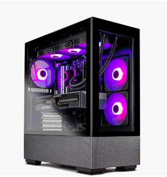

# product-card
# 🛒 Amazon Product Card Clone

This project is a **pixel-perfect clone** of a product listing card on Amazon, built using only **HTML** and **CSS**. The card displays key product details including an image, title, rating, pricing, shipping info, and an add-to-cart button — closely mimicking the real Amazon UI.

---

## ✅ Objective

To recreate a responsive and visually accurate Amazon product card using fundamental front-end web technologies — no frameworks or JavaScript involved.

---

## 🧠 Solution & Approach

### 🎯 Design Goal
Replicate the design shown in the reference image [here](https://bit.ly/3HLbKVQ), focusing on:
- Visual alignment
- Font usage and colors
- Button styling
- Responsiveness and clarity

### 🧩 Our Approach

1. **Image First Layout**:
   - Product image displayed at the top of the card.
   - Sized proportionally and made responsive.

2. **Content Sections**:
   - **Product title** styled to match font weight and color.
   - **Star ratings** created using Unicode stars with Font Awesome support for the dropdown chevron.
   - **Review count** and **"bought in past month"** text styled subtly.
   - **Price formatting** broken into dollars and cents using separate ``s for better control.
   - **Shipping info** including a second line using ` ` for separation.

3. **Call to Action**:
   - A bright, Amazon-style yellow “Add to Cart” button.
   - Styled with border radius, hover effect, and bold font.

4. **Responsive Structure**:
   - All elements are wrapped inside a `.card` container.
   - CSS `flexbox` is used for aligning the rating stars, review count, and dropdown arrow.

---

## 🔧 Tools & Technologies

- **HTML5**
- **CSS3**
- **Font Awesome** for the dropdown arrow (`fas fa-chevron-down`)
- **No JavaScript or frameworks used** — 100% pure frontend

---

## 🖼️ Screenshot

---

## 🚀 How to Run the Project

1. Clone or download the repo.
2. Open `index.html` in any web browser.

### Or use Live Server:
If using VS Code, right-click `index.html` and choose **"Open with Live Server"**.

---

## 🌐 Optional Hosting (GitHub Pages)

1. Push the project to a GitHub repository.
2. Go to `Settings > Pages`.
3. Choose `main` branch as the source.
4. GitHub will give you a link to access your live project!

---

## 💡 What I Learned

- How to structure a real-world card layout using only HTML and CSS
- Styling for clean UI using spacing, font-sizing, and positioning
- The importance of pixel-perfect design and accessibility
- Using Font Awesome icons to enhance UI elements

---

## 📌 Future Improvements

- Add hover interactions to elements (like underlining product title)
- Make the card responsive for mobile view
- Add a dropdown to show customer reviews
- Use real dynamic star ratings in JavaScript or React (future scope)

---

## 📬 Feedback

If you have any suggestions or improvements, feel free to open an issue or a pull request. Contributions are welcome!

---

## 👩‍💻 Author

**Your Name** – [Jailakshmi7683](https://github.com/jailakshmi7683)

